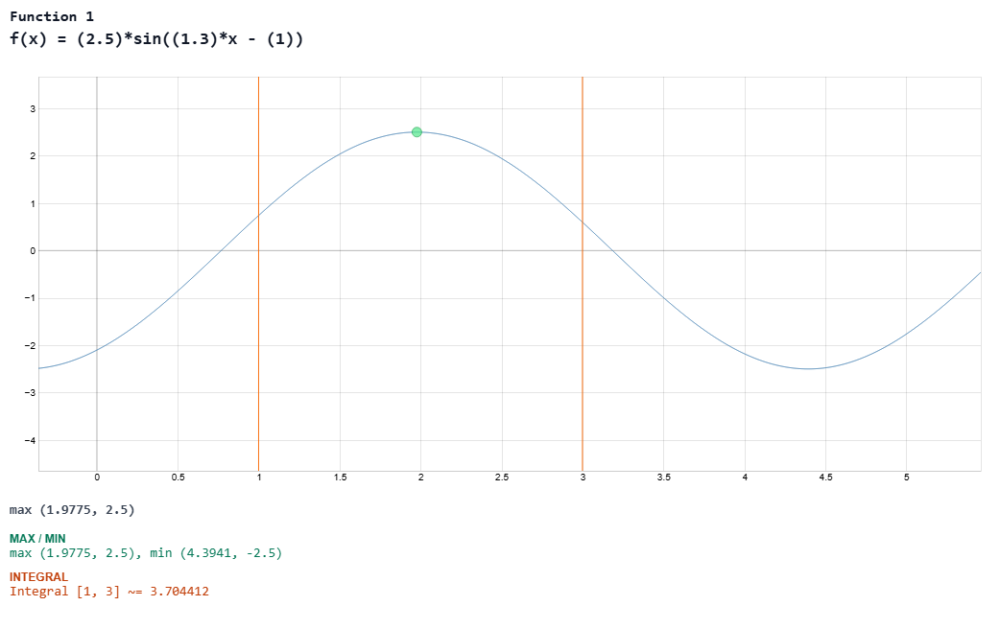

# Tracer Component


A Flexible function tracer for Vue 3, allowing users to plot mathematical expressions, manipulate variables in real-time, and perform calculus operations.

### Advanced Usage: External Control

You can also control the `Tracer` component externally (e.g., from a sidebar) by using a `ref` to access its exposed methods, such as `setExpr`.

```vue
<script setup>
import { ref } from 'vue'
import Tracer from '@ernestopinto/tracer'

const functions = ref({ /* ... */ })
const tracerRef = ref(null)

function updateFromOutside(expression, name) {
  // Directly set the expression and function name
  tracerRef.value?.setExpr(expression, name)
}
</script>

<template>
  <Tracer v-model:defs="functions" ref="tracerRef" />
  <button @click="updateFromOutside('x^3', 'Cubic')">Set to x^3</button>
</template>
```

## Main Features

### Plot Capabilities
- **Dynamic Plotting**: Renders mathematical functions of `x` (e.g., `A*sin(B*x - C)`) using `function-plot`.
- **Real-time Variables**: Define and manipulate variables (A, B, C, etc.) via interactive sliders, with immediate plot updates.
- **Interactive Navigation**:
  - **Zoom**: Use the mouse wheel to zoom in and out of the plot.
  - **Pan**: Click and drag to navigate through different areas of the coordinate system.
- **Resizable Container**: The plot area is both vertically and horizontally resizable with a custom, highly visible handle.
- **Export to PNG**: High-quality export of the current plot, including the function expression and any calculated results (zeros, extrema, integral).
- **Responsive Design**: Adapts to different screen sizes with a clean, Tailwind-based UI.
- **Customizable Visibility**: Hide or show specific sections (Axis Bounds, Variables, Calculus, Expression Input) via component props.

### Calculus Features
- **Zero Finding**: Numerically find and highlight the zeros (roots) of the function within the visible X-axis bounds.
- **Extrema Detection**: Identify and mark local maxima and minima of the expression.
- **Numerical Integration**:
  - Approximate the definite integral between two custom bounds.
  - Visual representation of the integration interval on the plot.
- **Point Highlighting**: Clicking on calculated results (zeros or extrema) highlights the exact point on the plot for better visualization.

## Usage

```vue
<script setup>
import { ref } from 'vue'
import Tracer from '@ernestopinto/tracer'

const functions = ref({
  f: [
    { name: "Sine Wave", f: "A*sin(B*x)" }
  ],
  d: {
    axxis: true,
    vars: true,
    calc: true,
    expr: true
  }
})
</script>

<template>
  <Tracer v-model:defs="functions" />
</template>

<style scoped>
  /* WorkAround for the VARS display (until new version fix) -> Force
     the Tracer variables grid to show more columns if needed, 
     or ensure it doesn't wrap too early within the project card */
  :deep(.grid.grid-cols-1.sm\:grid-cols-2.md\:grid-cols-3) {
    display: flex !important;
    flex-wrap: wrap !important;
    gap: 0.75rem !important;
  }

  :deep(.grid.grid-cols-1.sm\:grid-cols-2.md\:grid-cols-3 > *) {
    flex: 1 1 200px !important;
    min-width: 200px !important;
    display: block !important;
  }

  :deep(.grid.grid-cols-1.sm\:grid-cols-2.md\:grid-cols-3 button) {
    display: inline-flex !important;
    visibility: visible !important;
    opacity: 1 !important;
  }

  :deep(.grid.grid-cols-1.sm\:grid-cols-2.md\:grid-cols-3 button.w-full) {
    display: block !important;
    width: 100% !important;
    color: black!important;
    background-color: #eceaea!important;
  }
</style>
```
